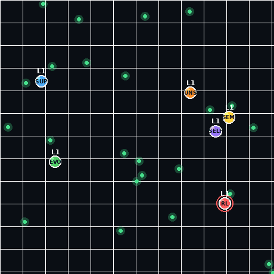

# 🧬 Paradigm Arena

**Six machine-learning paradigms, trained in Python, fight for survival in one browser arena.**

Every agent sees the **same input** and uses the **same action space** — the only thing that differs is *how its policy was learned*. They roam an [agar.io](https://agar.io)-style board, eat food to grow, swallow smaller agents, and the first to reach **level 10 wins**. Get eaten and you're out.



> The GIF above is rendered directly from the same engine (`make_gif.py`).

---

## The contestants

All six share an identical 13-feature view (nearest 2 food, nearest threat, nearest prey, own size) and the same 8-direction movement. Only the learning method changes:

| Agent | Paradigm | How it learns |
|------|----------|----------------|
| 🔴 **RL** | Reinforcement Learning | DQN-lite — trial and error to maximize reward (food + survival) |
| 🔵 **SUP** | Supervised (Imitation) | Behavioral cloning — copies an expert's state→action examples |
| 🟣 **SELF** | Self-Supervised | Learns a world model (predicts the next state), then plans one step ahead |
| 🟡 **SEMI** | Semi-Supervised | A few expert labels + lots of pseudo-labeled self-play |
| 🟢 **EVO** | Evolutionary | A population of networks evolves over generations (the fittest mutate & reproduce) |
| 🟠 **UNS** | Unsupervised | No reward — clusters food with k-means and heads to the densest cluster |

---

## How it works

1. **Train in Python.** Each agent is trained *solo* in a small `numpy` arena (food + prey + hazards) using its own paradigm. Training the whole roster takes ~1 minute.
2. **Export.** Every learned policy is written to `policies.json` (network weights, or a config for the heuristic agents).
3. **Run in the browser.** `index.html` embeds those weights and runs a tiny neural-network forward pass in plain JavaScript — no backend, no dependencies. The six frozen policies are dropped into one shared arena and compete.

Training each agent solo and *then* letting them compete is a deliberate choice: it sidesteps the notorious instability of multi-agent competitive RL while still producing a real head-to-head tournament.

### A note on the result

Imitation learning (**SUP**) tends to win most games — copying a near-optimal expert is hard to beat at foraging *and* fighting. That's an honest finding, not a bug: it's literally "survival of the fittest policy." Random food, random starts, and a touch of exploration noise still produce regular upsets from RL, Evolutionary, and Semi-supervised.

---

## Quick start

**Just play:** open `index.html` in any modern browser and press **▶ Start**. The trained models are already baked in.

**Retrain from scratch:**

```bash
pip install numpy          # only dependency for training
python train.py            # trains all 6 paradigms -> policies.json  (~1 min)
python build.py            # embeds policies.json into index.html
# then open index.html
```

**Regenerate the demo GIF** (optional):

```bash
pip install pillow numpy
python make_gif.py         # -> demo.gif
```

---

## Project layout

| File | What it is |
|------|------------|
| `index.html` | The game — self-contained, models embedded, just open it |
| `train.py` | The arena environment + all six learning algorithms (pure `numpy`) |
| `build.py` | Bakes `policies.json` into `index.html` |
| `make_gif.py` | Renders `demo.gif` from the engine (Pillow) |
| `eval.py` | Sanity-checks each trained policy vs a random baseline |
| `policies.json` | Exported trained policies |
| `index.template.html` | Source template (HTML/JS) with a placeholder for the policies |

---

## Verification

The browser inference was checked against the Python implementation on 400 random states across all networked agents — **0 mismatches** (max numerical difference ~1e-16). The multi-agent game loop and the smooth-render path are exercised by headless Node tests, and an anti-stuck system caps the worst "spinning in place" episode from ~250 steps down to ~15.

---

## Design details

- **State (13 features):** unit-direction + closeness to the two nearest food, the nearest bigger agent (threat) and nearest smaller agent (prey), plus own size.
- **Actions:** 8 compass directions (discrete).
- **Mechanics:** radius grows with score; bigger agents are slower (so leaders are catchable); eating an agent absorbs its score; level = 1 + ⌊score/3⌋, capped at 10.
- **Anti-stuck:** if an agent barely moves over a short window it briefly steers toward open space — this breaks the left/right limit cycles that discrete argmax policies fall into.

---

## License

MIT — see [LICENSE](LICENSE).
